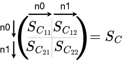

# DiffSimPy

An open source Differentiable Co-Simulation Python Framework for the Efficient Modelling and Optimization of Electromagnetic Circuit Cosimulations.

## Summary

- [Motivation](#motivation)
- [Main Features](#main-features)
- [Getting Started](#getting-started)
- [Usage](#usage)
- [License](#license)
- [Acknowledgments](#acknowledgments)

## Motivation
- Reconfigurable lumped elements of resonant structures significantly impact resonant behavior.
- Full-wave simulations are expensive and time-consuming.
- Electromagnetic co-simulation provides an efficient method to determine the altered field distribution due to the tuning of lumped elements.
- Furthermore setting lumped elements to specific values is often a non-trivial task.
- The use of gradients could improve efficiency of the optimization in tunable parameters in resonant structures.

## Main Features
The framework, built on PyTorch as the underlying matrix manipulation framework, offers the following features:
- **Parallel processing** of resulting electromagnetic fields from any given scattering parameters (S_C) and earlier preprocessing steps.
- Support for **gradient-based optimization** algorithms.
- GPU-accelerated computations.
- **Easy integration** into existing optimization pipelines.
- Compatibility with any circuit configuration, provided the scattering parameters are given.
- Full **control and reusability** due to the modular design.
- Adherence to the **standards of the CoSimPy Framework**, facilitating seamless integration into existing projects.

## Getting Started
The library was developed and tested with Python 3.10.14 in a Ubuntu Docker machine. If you choose to build your own environment you will need the following packages installed:

- cosimpy==1.4.0
- matplotlib==3.9.2
- numpy==2.1.1
- pytest==8.2.2
- torch==2.3.1

Other versions may work as well. You might as well install the package using `pip install diffsimpy` or when running the command in the same folder `pip install -e .`. For the installation and usage of e.g. cosimpy please refer to the [cosimpy documentation](https://github.com/umbertozanovello/CoSimPy).

Yet simpler: Install docker and run 
`docker build -t diffsimpy:latest .` in the terminal of your choice with the current directory being the cloned repo. 
The container can then be run and kept alive by using `docker run -d diffsimpy tail -f /dev/null`. You can then attach the machine to an IDE e.g. Visual Studio Code.


## Usage

### Example Usage

Initializing the example calculation pipeline is as simple as passing four arguments:

```python
from DiffSimPyPipeline import CalculationPipeline

CalculationPipeline(S_0, S_C_const, b_field=None, e_field=None, **kwarg)
```
- `S_0` being the exported s-tensor from full-wave electromagnetic solver has the shape of `[nf, n0, n0]`
- `S_C_const` being the user defined tensor containing static s-parameters that are not varied during optimization `[batch_size, nf, n0+n1, n0+n1]`
- `b_field` and `e_field` (optional) if calculation of magnetic or electric fields is desired `[batch_size, nf, n1, 3, npoints]`

The dimensions being the following:
| Parameter    | Description                                                                            |
|--------------|-------------------------------------------------------------------------|
| `batch_size` | Number of samples processed in parallel  |
| `n0`         | Number of ports in the unconnected structure |                           
| `n1`         | Number of ports in the connected structure exposed to external excitation| 
| `nf`         | Number of frequency points                                              | 
| `npoints`    | Number of points in the field                                           | 

S-parameters and indices that we want to optimize on are passed as a 1d `torch.tensor` to the forward function of the `pipeline`. The indices assign the values in the flattened list to positions in the $S_C$ tensor. For further information about the $S_C$ tensor refer to [explanation $S_C$](####explanation-sc) below.

```python
from DiffSimPy import DiffCoSimulator
from your_module import CalculationPipeline

# Initializing the pipeline
pipeline = CalculationPipeline(S_0=imported_s_tensor, S_C_const=user_defined_S_C_const)

# Running forward pass
b_field, e_field = pipeline.forward(s_params=parameters_to_optimize, indices=indices_in_S_C)

# Using the computed fields
print(f"Magnetic Field: {b_field.shape}")
print(f"Electric Field: {e_field.shape}")
```

#### Explanation $S_C$
The variable `S_C` represents an intermediate multiport network that manages the connection between the resonant structure (with its output ports `n0`) and the output ports of the connected structure (`n1`). The scattering tensor (`S_C`) links the resonant structure to the network.


In general, `S_C` can be divided into four components: `S_C_11`, `S_C_12`, `S_C_21`, and `S_C_22`. Here, `S_C_11` and `S_C_22` describe the reflection parameters, while `S_C_12` and `S_C_21` represent the transmission parameters between the ports. 



The S-parameters of `S_C_const` remain fixed during the optimization process. Parameters subject to optimization are passed to the calculation pipeline as `S_C_var`.

The definition of `S_C` aligns with the CoSimPy framework, ensuring compatibility and consistency with other network co-simulations.

### Overview over source files
There are three files in ./src:
- DiffSimPy.py
- DiffSimPyPipeline.py
- NetworkFunctions.py

### DiffSimPy.py 
DiffSimPy.py contains the baseclass `DiffCoSimulator` which provides the essential methods and organises predefined attributes for calculation. The user would normally inherit from this class into a caculation pipeline. An examplary calculation pipeline that can be reused by the user is provided in DiffSimPyPipeline. For further details please refere to the individual docstrings in the file.

### DiffSimPyPipeline.py
The `CalculationPipeline` class inherits from the `DiffCoSimulator` base class provided by the `DiffSimPy` package. This class can be customized by the user for tailored preprocessing. As a default a characteristic impedance `z0`=50 $\Omega$ and a Power `P_inc`=1W is assumed.

The general workflow follows the description in [Workflow Pipeline](#workflow-pipeline) 

The pipeline allows for the optimization of any arbitrary S-parameter within the `S_C` tensor (see further explanation below). The pipeline is therefore designed to offer the user maximum flexibility in defining custom preprocessing steps.

1. **User-Defined Preprocessing**:  
   User defined preprocessing of data that results in s-parameters. The user can build any desired preprocessing step that relate to the individual elements of S_C_var. The custom preprocessing step must output a one-dimensional tensor. The user defines the `indices` that map each element of this output tensor to corresponding positions in the `S_C_var` tensor. `indices` contains two tensors with indices for x and y position assignment in S_C_var. The first tensor containing the indices for rows (x) and the second containing the indices for columns (y). This ensures that the zero-valued `S_C_var` tensor is populated with the relevant values, as determined by the user-defined indices.

2. **Constant S-Parameter Definition**:  
   Users also define an `S_C_const` tensor containing constant S-parameters that remain unchanged during optimization. This allows for portions of the multiport network to stay fixed, while other parts (defined by `S_C_var`) are optimized.

3. **Combining `S_C_var` and `S_C_const`**:  
   The framework then adds the `S_C_var` and `S_C_const` tensors. This creates the complete `S_C` tensor that defines the behavior of the multiport network in the simulation.

4. **Field Combination and Simulation**:  
   After constructing the `S_C` tensor, the pipeline proceeds with the field calculations, ultimately combining the electromagnetic fields as part of the final simulation output.

### NetworkFunctions.py
Individual functions that may be useful for the calculation of s-parameters for e.g. 1-port networks as well as for calculating resonant parameters of a resonant structure are stored in here. For more details refer to the docstrings of the individual functions.

## License

This project is licensed under the MIT License - see the [LICENSE](LICENSE) file for details.

## Acknowledgements
This research is supported by grant money received from the U Bremen Research Alliance/AI Center for Health Care, financially supported by the Federal State of Bremen

I would like to express my profound gratitude to Umberto Zanovello, whose work on CoSimPy greatly inspired my own research and development of this simulator. [CoSimPy](https://www.sciencedirect.com/science/article/pii/S0169260722000694)